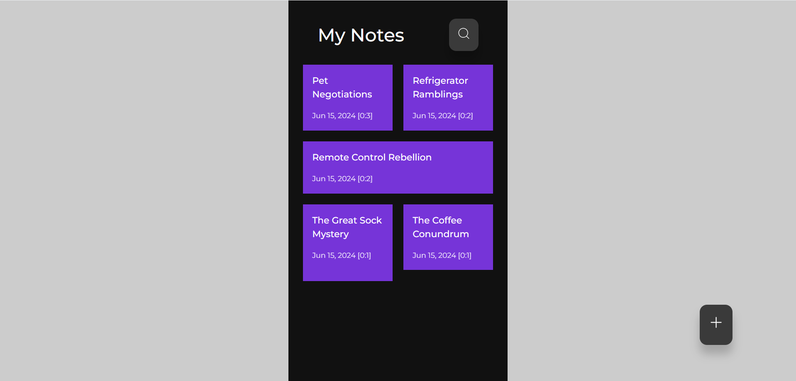

# NoteNest

## Overview

NoteNest is a simple and intuitive application for creating, managing, and organizing your notes. Built using React and CSS, this app leverages the power of Create React App to provide a robust foundation for development.

## Features

- **Create Notes**: Easily create and save notes.
- **Edit Notes**: Modify the content of your notes as needed.
- **Delete Notes**: Remove notes that are no longer needed.
- **Responsive Design**: Enjoy a seamless experience across all devices.

## Getting Started

### Prerequisites

Make sure you have the following installed on your machine:

- Node.js
- npm (Node Package Manager) or yarn

### Installation

1. **Clone the repository**:

    ```sh
    git clone https://github.com/your-username/note-app.git
    cd note-app
    ```

2. **Install dependencies**:

    If you use npm:

    ```sh
    npm install
    ```

    If you use yarn:

    ```sh
    yarn install
    ```

3. **Start the development server**:

    If you use npm:

    ```sh
    npm start
    ```

    If you use yarn:

    ```sh
    yarn start
    ```

    This will start the app and open it in your default browser. The app will automatically reload if you make changes to the code.
